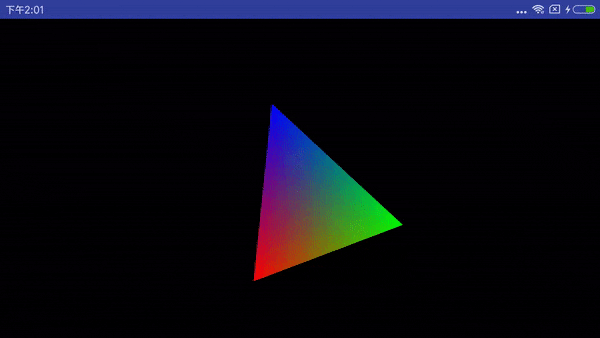
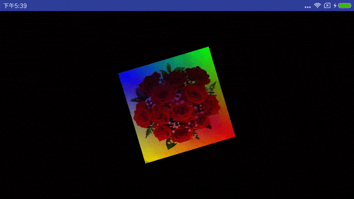
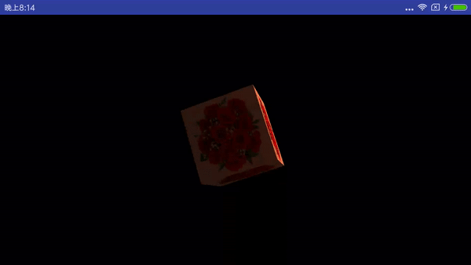

# 学习OpenGL
参考[LearnOpenGL CN](https://learnopengl-cn.github.io/)上的C++教程，基于Java实现Android版本。

# 内容介绍
#### shape
利用OpenGL实现基本的二维图形绘制和动画效果。涉及OpenGL基本的顶点着色器，片元着色器等概念。需要基本的GLSL编程。

#### texture
在基础图形绘制的基础上，加上纹理渲染。纹理渲染和动画是一些贴纸特效的技术基础。

### cube
立方体绘制，涉及3D绘制，以及光照效果。
